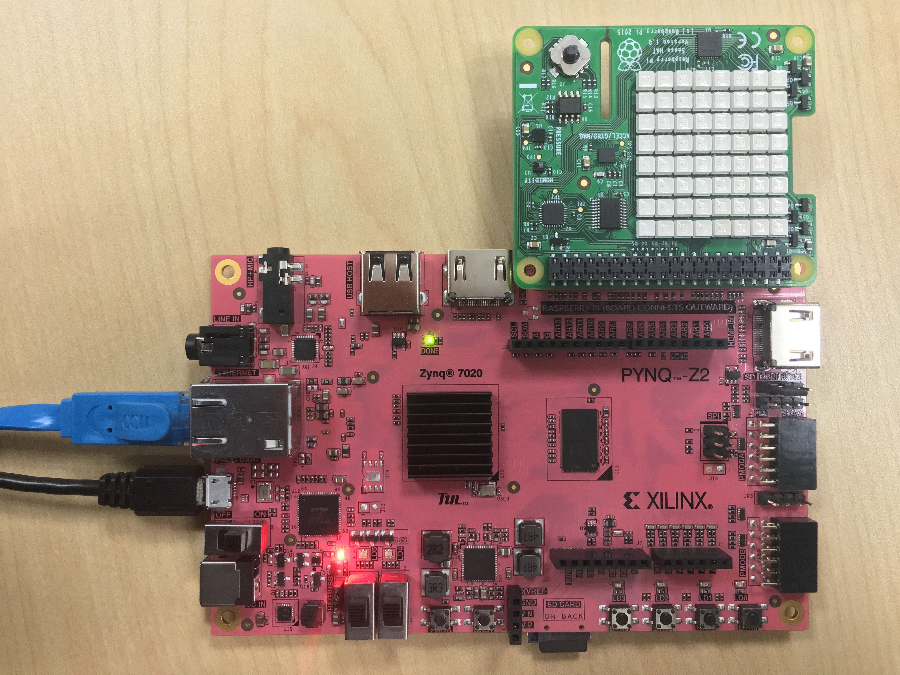

# PYNQ-Sense-HAT

This repo contains the pip install package for Sense HAT Overlay on PYNQ. It's only support PYNQ Z2 board currently. There are 3 notebook explaining the usage of Sense HAT.

## Quick Start

In order to install the Overlay on your PYNQ board, open a terminal and type:

### *Online Install*
```shell
# (on PYNQ v2.3 or v2.4 only)
sudo pip3 install git+https://github.com/xupsh/pynq-sense-hat.git
```
### *Standalone Install*
```shell
# (on PYNQ v2.3 or v2.4 only)
cd pynq-sense-hat
sudo python setup.py install
```

NOTE: This command must be run as root.

## Run the examples  
After the installation, a folder pynq-sense-hat shuold be seen in `/home/xilinx/jupyter_notebooks`.There are 3 .ipynb files you can try..

## About Sense HAT

Sense HAT is a platform designed with multiple devices integrated and Raspberry Pi interface. All the devices on the Board can be access via IIC bus (GPIO2 as SDA and GPIO3 as SCL) with different device address. 


1.LED matrix controller: This microcontroller drives the LED matrix. Address:0x46  
2.LED matrix: This 8x8 LED matrix displays characters or pictures.  
3.LSM9DS1: The all-in-one gyroscope, accelerometer, and magnetometer will measure the orientation of objects, an increase in speed, and the strength and direction of a magnetic field.  
4.Joystick: This five-button joystick allows for up, down, left, and right movements, as well as an Enter via a click.  
5.LPS25H: A temperature and humidity sensor.  
6.HTS221: A barometric pressure sensor.  

More information about it, please click [here](https://www.raspberrypi.org/products/sense-hat/).
